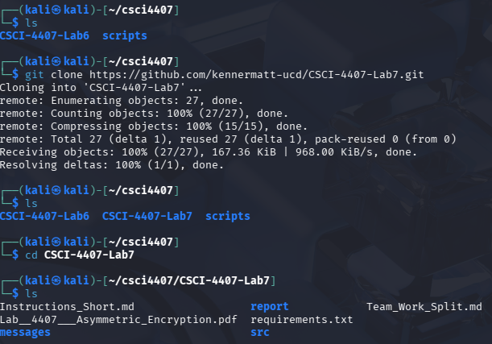
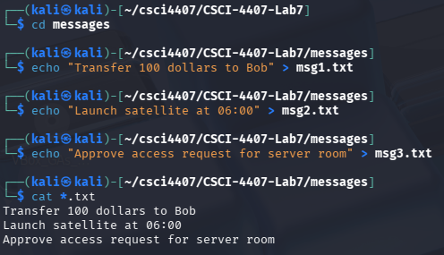
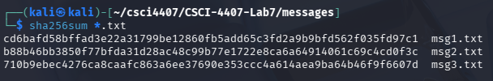
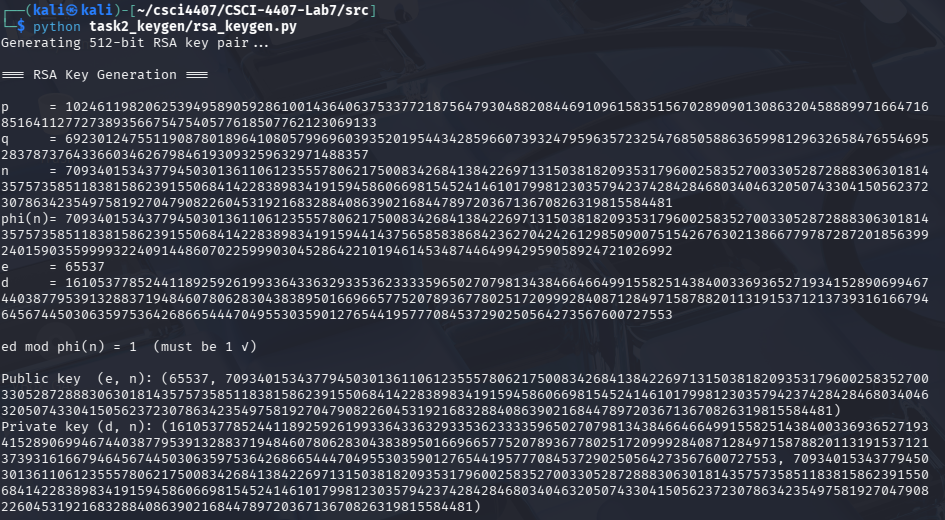
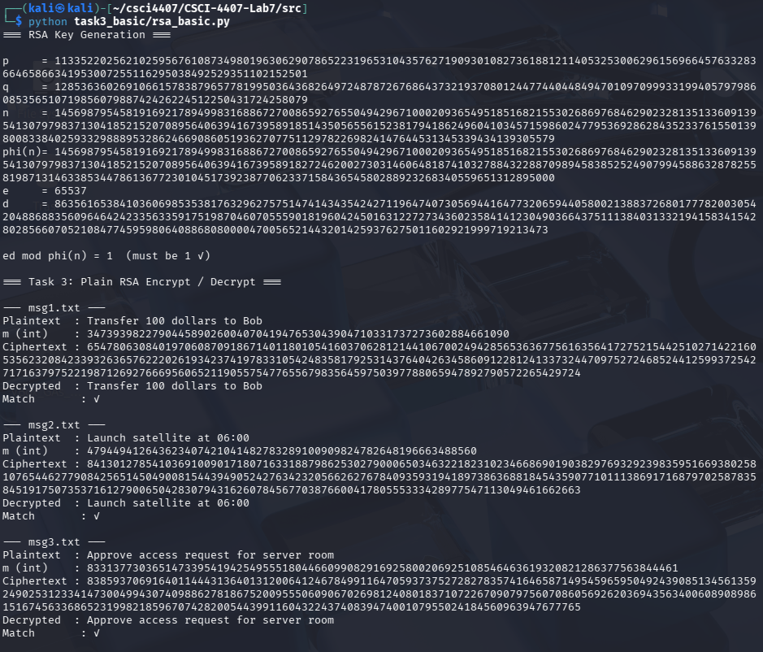
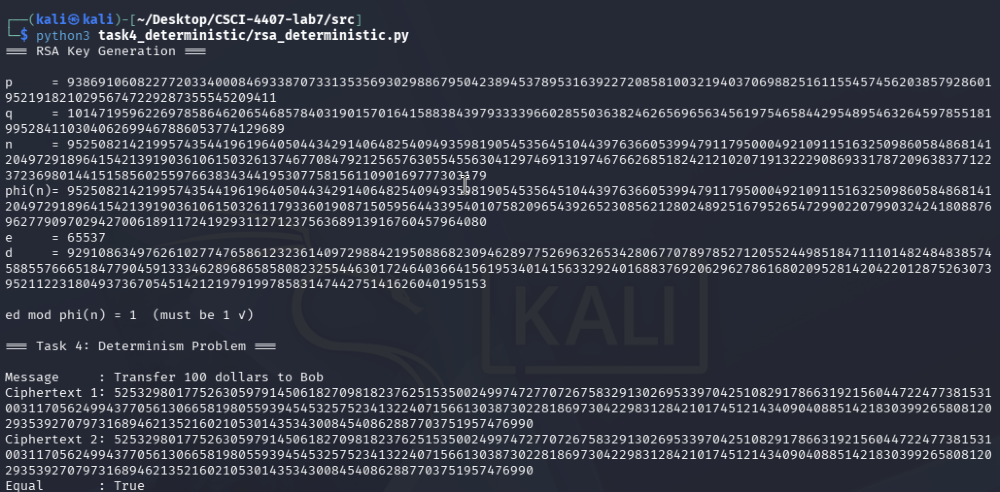
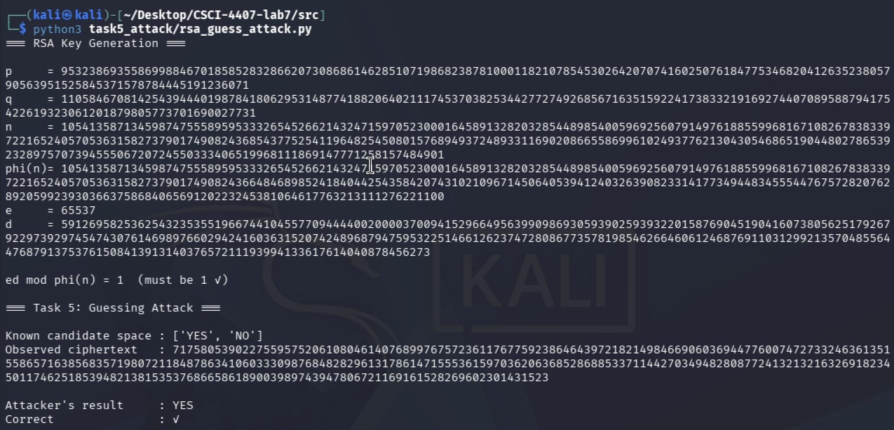
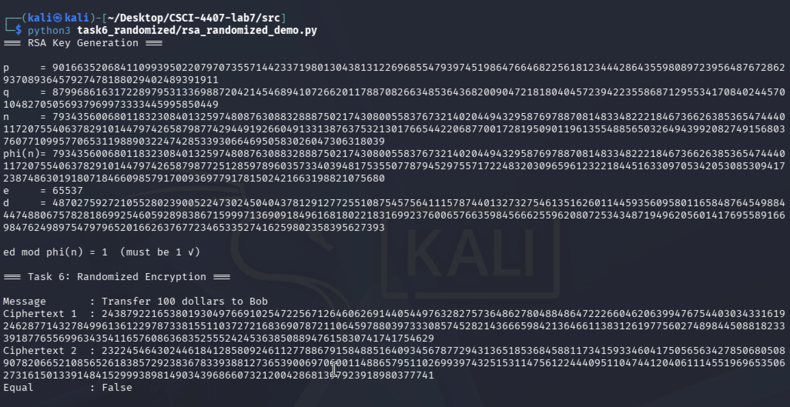
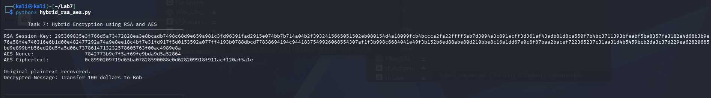

# Lab 7 — Group 10 — Public-Key Encryption (RSA, IND-CPA, Hybrid)

**Course:** CSCI/CSCY 4407 — Security & Cryptography
**Semester:** Spring 2026
**Group Members:** Cassius Kemp, Matthew Kenner, Jonathan Le

---

## Task 1 — Setup & Messages

### Overview

This task creates the working directory structure and three plaintext message files used
throughout the lab. SHA-256 hashes are computed to establish a baseline fingerprint for
each file, confirming integrity before any encryption is performed.

### Steps

**Step 1 — Create directory and message files**

```bash
mkdir RSA_Lab
cd RSA_Lab
echo "Transfer 100 dollars to Bob" > msg1.txt
echo "Launch satellite at 06:00" > msg2.txt
echo "Approve access request for server room" > msg3.txt
```

**Step 2 — Verify contents and SHA-256 hashes**

```bash
cat *.txt
sha256sum *.txt
```

### Screenshots

**Screenshot 1 — Directory listing and file contents**





**Screenshot 2 — SHA-256 hashes**



### Results

| File    | Contents                                | SHA-256 |
|---------|-----------------------------------------|---------|
| msg1.txt | Transfer 100 dollars to Bob            | cd6bafd58bffad3e22a31799be12860fb5add65c3fd2a9b9bfd562f035fd97c1 |
| msg2.txt | Launch satellite at 06:00              | b88b46bb3850f77bfda31d28ac48c99b77e1722e8ca6a64914061c69c4cd0f3c |
| msg3.txt | Approve access request for server room | 710b9ebec4276ca8caafc863a6ee37690e353ccc4a614aea9ba64b46f9f6607d |

### Explanation

Three distinct messages are chosen to represent realistic high-stakes communications.
Hashing them upfront establishes a verifiable reference so that any modification during
encryption experiments can be detected. All subsequent tasks read from these files.

---

## Task 2 — RSA Key Generation

### Overview

RSA security depends on the difficulty of factoring the product of two large primes.
This task generates the full key pair from scratch: primes p and q, modulus n,
Euler's totient φ(n), public exponent e, and private exponent d, then verifies
that `ed ≡ 1 (mod φ(n))`.

### Source Code

```python

"""
rsa_core.py — Shared RSA primitives for Lab 7.

All task scripts import from this module so that keys and crypto logic
are implemented once and reused consistently across the lab.
"""

import random
import math


# ---------------------------------------------------------------------------
# Primality and prime generation
# ---------------------------------------------------------------------------

def is_prime(n: int, k: int = 20) -> bool:
    """Miller-Rabin primality test with k rounds.

    Returns True if n is (probably) prime, False if definitely composite.
    k=20 gives a false-positive probability of at most 4^(-20) ≈ 10^(-12).
    """
    if n < 2:
        return False
    if n == 2 or n == 3:
        return True
    if n % 2 == 0:
        return False

    # Write n-1 as 2^r * d with d odd
    r, d = 0, n - 1
    while d % 2 == 0:
        r += 1
        d //= 2

    for _ in range(k):
        a = random.randrange(2, n - 1)
        x = pow(a, d, n)

        if x == 1 or x == n - 1:
            continue

        for _ in range(r - 1):
            x = pow(x, 2, n)
            if x == n - 1:
                break
        else:
            return False  # composite

    return True  # probably prime


def generate_prime(bits: int = 512) -> int:
    """Return a random prime with the given bit length."""
    while True:
        candidate = random.getrandbits(bits) | (1 << (bits - 1)) | 1  # odd, top bit set
        if is_prime(candidate):
            return candidate


# ---------------------------------------------------------------------------
# Key generation
# ---------------------------------------------------------------------------

def generate_keys(bits: int = 512):
    """Generate an RSA key pair.

    Args:
        bits: Bit length for each prime p and q (n will be ~2*bits).

    Returns:
        (public_key, private_key) where:
            public_key  = (e, n)
            private_key = (d, n)

    Also prints p, q, n, phi(n), e, d and verifies ed ≡ 1 (mod phi(n)).
    """
    # Step 1: choose two distinct primes p and q
    p = generate_prime(bits)
    q = generate_prime(bits)
    while q == p:
        q = generate_prime(bits)

    # Step 2: compute modulus and Euler's totient
    n = p * q
    phi_n = (p - 1) * (q - 1)

    # Step 3: choose public exponent e coprime with phi(n)
    # 65537 is the standard choice: prime, small Hamming weight, fast exponentiation
    e = 65537
    if math.gcd(e, phi_n) != 1:
        # Fallback: search for a valid e (rare with 512-bit primes)
        e = 3
        while math.gcd(e, phi_n) != 1:
            e += 2

    # Step 4: compute private exponent d = e^(-1) mod phi(n)
    d = pow(e, -1, phi_n)  # Python 3.8+ modular inverse

    # Verification
    assert (e * d) % phi_n == 1, "Key generation failed: ed ≢ 1 (mod phi(n))"

    print("=== RSA Key Generation ===\n")
    print(f"p     = {p}")
    print(f"q     = {q}")
    print(f"n     = {n}")
    print(f"phi(n)= {phi_n}")
    print(f"e     = {e}")
    print(f"d     = {d}")
    print(f"\ned mod phi(n) = {(e * d) % phi_n}  (must be 1 ✓)")

    return (e, n), (d, n)


# ---------------------------------------------------------------------------
# Encryption and decryption
# ---------------------------------------------------------------------------

def msg_to_int(message: str) -> int:
    """Convert a UTF-8 string to a non-negative integer."""
    return int.from_bytes(message.encode("utf-8"), byteorder="big")


def int_to_msg(value: int) -> str:
    """Convert a non-negative integer back to a UTF-8 string."""
    byte_length = (value.bit_length() + 7) // 8
    return value.to_bytes(byte_length, byteorder="big").decode("utf-8")


def encrypt(m: int, pub_key: tuple) -> int:
    """RSA encryption: c = m^e mod n.

    Args:
        m:       plaintext as a non-negative integer (must be < n)
        pub_key: (e, n)

    Returns:
        ciphertext integer c
    """
    e, n = pub_key
    assert m < n, "Message integer must be smaller than modulus n"
    return pow(m, e, n)


def decrypt(c: int, priv_key: tuple) -> int:
    """RSA decryption: m = c^d mod n.

    Args:
        c:        ciphertext integer
        priv_key: (d, n)

    Returns:
        plaintext integer m
    """
    d, n = priv_key
    return pow(c, d, n)

```

### Steps

**Step 1 — Run the key generation script**

```bash
cd src
python task2_keygen/rsa_keygen.py
```
### Source Code

```python
"""
Task 2 — RSA Key Generation
Generates an RSA key pair and prints all parameters with verification.
Run from the src/ directory: python task2_keygen/rsa_keygen.py
"""

import sys
import os
sys.path.insert(0, os.path.dirname(os.path.dirname(__file__)))

from rsa_core import generate_keys


def main():
    print("Generating 512-bit RSA key pair...\n")
    pub, priv = generate_keys(bits=512)
    print("\nPublic key  (e, n):", pub)
    print("Private key (d, n):", priv)


if __name__ == "__main__":
    main()

```
### Screenshots

**Screenshot 1 — `rsa_keygen.py` terminal output**



### Results

| Parameter | Value |
|-----------|-------|
| p         | 10246119820625394958905928610014364063753377218756479304882084469109615835156702890901308632045888997166471685164112772738935667547540577618507762123069133 |
| q         | 6923012475511908780189641080579969603935201954434285966073932479596357232547685058863659981296326584765546952837873764336603462679846193093259632971488357 |
| n         | 70934015343779450301361106123555780621750083426841384226971315038182093531796002583527003305287288830630181435757358511838158623915506841422838983419159458606698154524146101799812303579423742842846803404632050743304150562372307863423549758192704790822604531921683288408639021684478972036713670826319815584481 |
| φ(n)      | 7093401534377945030136110612355578062175008342684138422697131503818209353179600258352700330528728883063018143575735851183815862391550684142283898341915944143756585838684263270424612985090075154267630213866779787287201856399240159035599993224091448607022599903045286422101946145348744649942959058924721026992 |
| e         | 65537 |
| d         | 1610537785244118925926199336433632933536233335965027079813438466466499155825143840033693652719341528906994674403877953913288371948460780628304383895016696657752078936778025172099928408712849715878820113191537121373931661679464567445030635975364268665444704955303590127654419577708453729025056427356700727553 |
| ed mod φ(n) | 1 |

Public key (e, n):
(65537, 70934015343779450301361106123555780621750083426841384226971315038182093531796002583527003305287288830630181435757358511838158623915506841422838983419159458606698154524146101799812303579423742842846803404632050743304150562372307863423549758192704790822604531921683288408639021684478972036713670826319815584481)

Private key (d, n):
(1610537785244118925926199336433632933536233335965027079813438466466499155825143840033693652719341528906994674403877953913288371948460780628304383895016696657752078936778025172099928408712849715878820113191537121373931661679464567445030635975364268665444704955303590127654419577708453729025056427356700727553,
70934015343779450301361106123555780621750083426841384226971315038182093531796002583527003305287288830630181435757358511838158623915506841422838983419159458606698154524146101799812303579423742842846803404632050743304150562372307863423549758192704790822604531921683288408639021684478972036713670826319815584481)

### Explanation

Two distinct 512-bit primes are generated using the Miller-Rabin primality test. Their
product n forms the RSA modulus; factoring n is computationally infeasible at this bit
length. The public exponent e = 65537 is the industry-standard choice — it is prime,
has low Hamming weight (binary `10000000000000001`), and makes modular exponentiation
fast without compromising security. The private exponent d is computed as the modular
inverse of e modulo φ(n) using Python's built-in `pow(e, -1, phi_n)`. The assertion
`ed ≡ 1 (mod φ(n))` confirms that encryption and decryption are exact inverses.

---

## Task 3 — Plain RSA Encryption and Decryption

### Overview

Each message file is converted to an integer, encrypted with the public key
(`c = m^e mod n`), decrypted with the private key (`m = c^d mod n`), and
the recovered text is verified against the original.

### Source Code

```python
"""
Task 3 — Plain RSA Encryption and Decryption
Encrypts each message file with RSA and decrypts it, verifying correctness.
Run from the src/ directory: python task3_basic/rsa_basic.py
"""

import sys
import os
sys.path.insert(0, os.path.dirname(os.path.dirname(__file__)))

from rsa_core import generate_keys, encrypt, decrypt, msg_to_int, int_to_msg

MESSAGES_DIR = os.path.join(os.path.dirname(__file__), "..", "..", "messages")


def main():
    pub, priv = generate_keys(bits=512)
    e, n = pub

    print("\n=== Task 3: Plain RSA Encrypt / Decrypt ===\n")

    for filename in sorted(os.listdir(MESSAGES_DIR)):
        if not filename.endswith(".txt"):
            continue

        path = os.path.join(MESSAGES_DIR, filename)
        with open(path, "r") as f:
            plaintext = f.read().strip()

        m = msg_to_int(plaintext)
        c = encrypt(m, pub)
        recovered_int = decrypt(c, priv)
        recovered = int_to_msg(recovered_int)

        print(f"--- {filename} ---")
        print(f"Plaintext  : {plaintext}")
        print(f"m (int)    : {m}")
        print(f"Ciphertext : {c}")
        print(f"Decrypted  : {recovered}")
        print(f"Match       : {'✓' if recovered == plaintext else '✗ MISMATCH'}\n")


if __name__ == "__main__":
    main()

```

### Steps

**Step 1 — Run the basic RSA script**

```bash
python task3_basic/rsa_basic.py
```

### Screenshots

**Screenshot 1 — `rsa_basic.py` terminal output**



### Results

| File     | Plaintext                               | Ciphertext | Match |
|----------|-----------------------------------------|------------------------|-------|
| msg1.txt | Transfer 100 dollars to Bob            | 65478063084019706087091867... | ✓ |
| msg2.txt | Launch satellite at 06:00              | 84130127854103691009017180... | ✓ |
| msg3.txt | Approve access request for server room | 83859370691640114443136401... | ✓ |

### Explanation

The message string is converted to an integer by treating its UTF-8 bytes as a
big-endian integer. `pow(m, e, n)` performs modular exponentiation efficiently
using Python's built-in fast exponentiation — this is the only computation needed
for encryption. Decryption is identical in structure (`pow(c, d, n)`), exploiting
the mathematical relationship `(m^e)^d ≡ m (mod n)` guaranteed by Euler's theorem.
All three messages decrypt correctly, confirming the implementation is correct.
However, Task 4 will show that this scheme provides no security guarantee because
it is deterministic.

---

## Task 4 — Determinism Problem

### Overview

Plain RSA is a deterministic function: given the same key and message, it always
produces the same ciphertext. This task demonstrates the problem by encrypting the
same message twice and showing the outputs are identical.

### Source Code

```python
# src/task4_deterministic/rsa_deterministic.py  (see full file in submission)

c1 = encrypt(m, pub)
c2 = encrypt(m, pub)
print(c1 == c2)  # True
```

### Steps

**Step 1 — Run the determinism script**

```bash
python task4_deterministic/rsa_deterministic.py
```

### Screenshots



### Explanation

Because `c = m^e mod n` is a pure function of m and the public key, identical inputs
always yield identical outputs. An attacker observing network traffic who sees the same
ciphertext appear twice immediately knows the same plaintext was sent twice, even without
breaking RSA. More dangerously, if the plaintext space is small (e.g., YES/NO, approved/denied),
the attacker can pre-compute ciphertexts for all candidates and look up any observed
ciphertext — this is the guessing attack demonstrated in Task 5.

---

## Task 5 — Guessing Attack

### Overview

When the set of possible plaintexts is small and known, an attacker with only the
public key can recover any ciphertext by encrypting every candidate and comparing.

### Source Code

```python
# src/task5_attack/rsa_guess_attack.py  (see full file in submission)

def guessing_attack(target_ciphertext, pub_key, candidates):
    for candidate in candidates:
        m = msg_to_int(candidate)
        if encrypt(m, pub_key) == target_ciphertext:
            return candidate
    return None
```

### Steps

**Step 1 — Run the guessing attack script**

```bash
python task5_attack/rsa_guess_attack.py
```

### Screenshots

**Screenshot 1 — `rsa_guess_attack.py` terminal output**



### Explanation

The attacker knows the public key (e, n) — it is public by definition — and knows
the candidate space {YES, NO}. By computing `encrypt("YES", pub)` and `encrypt("NO", pub)`
and comparing each to the observed ciphertext, the attacker recovers the plaintext in
at most two operations. No private key, no factoring, no cryptanalysis required. This
attack generalises to any small or predictable message space (e.g., binary decisions,
short status codes), and is a direct consequence of the determinism shown in Task 4.

---

## Task 6 — Randomized Encryption

### Overview

Prepending a random nonce to the message before encryption ensures the same plaintext
produces a different ciphertext every time, defeating the guessing attack.

### Source Code

```python

nonce = random.getrandbits(64)
combined = nonce_bytes + message_bytes  # nonce || message
c = encrypt(combined_as_int, pub)
```

### Steps

**Step 1 — Run the randomized encryption script**

```bash
python task6_randomized/rsa_randomized_demo.py
```

### Screenshots

**Screenshot 1 — `rsa_randomized_demo.py` terminal output**



### Explanation

By prepending a fresh 64-bit random nonce before encryption, two encryptions of the same
message produce different integers, and therefore different ciphertexts. The attacker's
guessing attack from Task 5 fails because pre-computing `encrypt("YES", pub)` now produces
a value that will almost certainly never match any observed ciphertext — each encryption
uses a fresh nonce. This is the intuition behind IND-CPA (indistinguishability under chosen
plaintext attack): an adversary who sees a ciphertext cannot tell which of two candidate
messages it encodes. Note that this nonce-based approach is a simplified demonstration;
in practice, RSA-OAEP (Optimal Asymmetric Encryption Padding) provides the standardised,
provably-secure randomised padding scheme.

---

## Task 7 — Hybrid Encryption (RSA + AES)

### Overview

Direct RSA encryption is limited to messages smaller than the modulus (~64 bytes for
512-bit RSA). Hybrid encryption solves this: encrypt the message with AES using a
random session key, then encrypt only the session key with RSA.

### Source Code

```python
import os
from Crypto.PublicKey import RSA
from Crypto.Cipher import AES, PKCS1_OAEP
from Crypto.Random import get_random_bytes

# --- HELPER FUNCTIONS ---
def GenerateRSAKeys():
    """Generates a 2048 bit size RSA key pair"""
    Key = RSA.generate(2048)
    PrivateKey = Key.export_key()
    PublicKey = Key.publickey().export_key()
    return PrivateKey, PublicKey

# --- MAIN EXECUTION ---
if __name__ == "__main__":
    print("="*60)
    print("        Task 7: Hybrid Encryption using RSA and AES")
    print("="*60)

    #Generates the recievers RSA keys
    PrivateKeyData, PublicKeyData = GenerateRSAKeys()
    
    #Loads plaintext message
    with open("msg1.txt", "rb") as f:
        Message = f.read()
    
    #Generates a random one time use AES session key (WOW sooo cool!!!!) :3
    SessionKey = get_random_bytes(16)
    
    #Encrypts our message we are sending with AES (using the session key from before)
    CipherAES = AES.new(SessionKey, AES.MODE_EAX)
    AESCiphertext, Tag = CipherAES.encrypt_and_digest(Message)
    
    #Encrypts the AES session key with RSA encryption (this uses the receiver's public key)
    RecipientKey = RSA.import_key(PublicKeyData)
    CipherRSA = PKCS1_OAEP.new(RecipientKey)
    EncryptedSessionKey = CipherRSA.encrypt(SessionKey)

    print(f"RSA Session Key: {EncryptedSessionKey.hex()}")
    print(f"AES Nonce:                 {CipherAES.nonce.hex()}")
    print(f"AES Ciphertext:            {AESCiphertext.hex()}")
    
    #Decrypt the AES session key with RSA decryption ( this uses receiver's private key)
    PrivateKey = RSA.import_key(PrivateKeyData)
    CipherRSADecrypter = PKCS1_OAEP.new(PrivateKey)
    DecryptedSessionKey = CipherRSADecrypter.decrypt(EncryptedSessionKey)
    
    #Use the session key to decrypt the AES encrypted ciphertext
    CipherAESDecrypter = AES.new(DecryptedSessionKey, AES.MODE_EAX, nonce=CipherAES.nonce)
    
    try:
        DecryptedMessage = CipherAESDecrypter.decrypt_and_verify(AESCiphertext, Tag)
        print("\nOriginal plaintext recovered.")
        print(f"Decrypted Message: {DecryptedMessage.decode()}")
        assert Message == DecryptedMessage
    except ValueError:
        print("\n Message integrity check failed, It seems that the message may have been tampered with :( ")

    print("\n" + "="*60)
```

### Steps

**Step 1 — Run the hybrid encryption script**

```bash
python3 hybrid_rsa_aes.py
```

### Screenshots

**Screenshot 1 — `hybrid_rsa_aes.py` terminal output**



### Explanation

For this task we use a 256 bit AES session key this is generated newly each time we want to send a message. The message is then encrypted with AES style encryption this is fast, uses symmetric encryption techniques, and is suitable for all lengths of data. The 32 byte AES key is then also encrypted but with an RSA encryption, this allows us to transport our message securly like a fully enclosed rail (This acts as our secure transport mechanism). Once the recipient receives the message the recipent uses their private RSA key to recover the AES key that was sent to them, the key is then used to decrypt the message sent. This hybrid encryption method is used in most moderrn asymmetric cryptography systems that we see in the real world, TLS uses RSA or ECDH to exchange a symmetric key, then AES for the actual data transporting; PGP also does the same. Hybrid encryption combines the key management advantages of asymmetric encryption cryptography techniques with the speed and flexibility of symmetric cryptography techniques allowing for admins to get the benefits of both systems.

---

## Task 8 — Security Comparison

### Overview

A summary of all four encryption approaches evaluated in this lab.

### Results Table

| Method | Randomized? | Equality Leakage | Practical for Large Data? | Secure? | Recommendation |
|---|:---:|:---:|:---:|:---:|---|
| Plain RSA | No | Yes | No | No | Never use by itself |
| Deterministic RSA | No | Yes | No | No | No |
| Randomized RSA (nonce demo) | Yes | No | No | No | No |
| Hybrid (RSA + AES) | Yes | No | Yes | Yes | Yes |

### Explanation

Both the plain and deterministic RSA are identical in the context of this issue as both produce the same ciphertext for the same input and are vulnerable to any type of guessing attacks. The nonce based randomisation from Task 6 eliminates equality leakage but does not solve the size limitation that RSA bring with it. Hybrid encryption addresses all of these problems the AES handles length of messages efficiently and without issue (addressing the length issue of RSA) and the never same AES key per session provides the randomness needed, this means that two encryptions of the same message will produce different ciphertexts. The only one that should be considered for practical secure direction in the future is the hybrid encryption using RSA for key wrapping and AES for encrypting the message it self.

In our experiments it shows that randomness is the most important factor when dealing with improving the practical security of our public key encryption. The use of mathematica one wayness is what the randomness needs to be built on the make the randomness sucessful as it prevents the attacker from reversing the encryption process to claim sensitive information however, it is not enough on its own to prevent common attacks. Task 3 demonstates that a system that relies solely on one wayness alone is deterministic and this is shown in task 5 as we see that the attacker is able to use a guessing attack to encrpyt their own guesses using the public key to determine the contents of the ciphertext. We then see in task 6 that when we introduce randomness we no longer have the issues presented by deterministic encryption, as each message is now encrypted and produce a different ciphertext per each encryption. This additon of randomness completely defeats the use of the deterministic guessing attacks, as the attacks guesses would never match the produced ciphertext.  

---

## Task 9 — Reflection

Deterministic encryption fails because it is function of purely just the plaintext and public key, this means that the same input always produces the same output. An attacker who can observe ciphertexts and knows (or can guess) the plaintext space can recover messages without touching the private key, simply by encrypting candidates and comparing them using the public key for encryption as shown in Task 5. In IND-CPA it is required that no adversary can distinguish the encryption of one message from another with better than 50% probability, this means that deterministic encryption fails this as the adversary only needs to encrypt the messages themselves and compare it to the ciphertext. Randomness fixes this by making the ciphertext a function of both the plaintext and a newly generated unpredictable value, this means that no pre computation is possible in this case. Hybrid encryption is used in practice because RSA can only encrypt data smaller than its modulus, this makes it considerably slower than AES, and requires carefully designed padding to still be secure. By using RSA purely for key transport and AES for the data transport, we get the key management benefits of asymmetric encryption combined with the
speed and flexibility of symmetric encryption. This model is used by most modern systems in the real world today for its security benefits.

---
